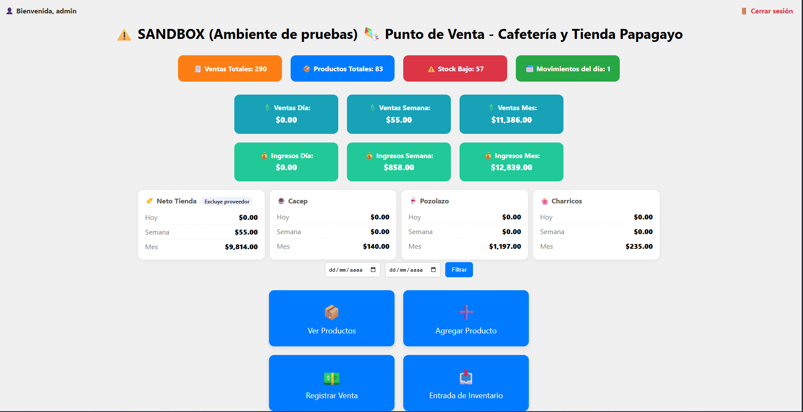

# Papagayo Store System

🛍 **Sistema de ventas e inventario** para la tienda del Museo Interactivo Papagayo.

## 📂 Contenido
- `schema.sql`: Estructura de base de datos (MySQL).
- `screenshots/`: Capturas de pantalla de la interfaz.

## 📝 Características
- Gestión de inventario con roles de usuario (admin, usuario, limitado).
- Registro de ventas con exportación a PDF/Excel.
- Dashboard con métricas de ventas diarias y productos más vendidos.
- Modo oscuro y diseño responsive.

## 🛠 Tecnologías
- **PHP/MySQL**
- **Bootstrap**
- **JavaScript**
- **phpMyAdmin** para administración

## 📸 Demo

---
⭐ **Proyecto educativo** — Datos de ejemplo y sin credenciales reales.
