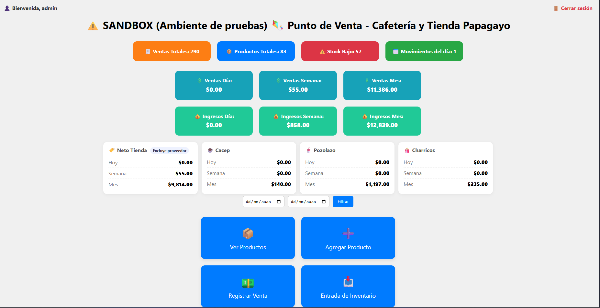
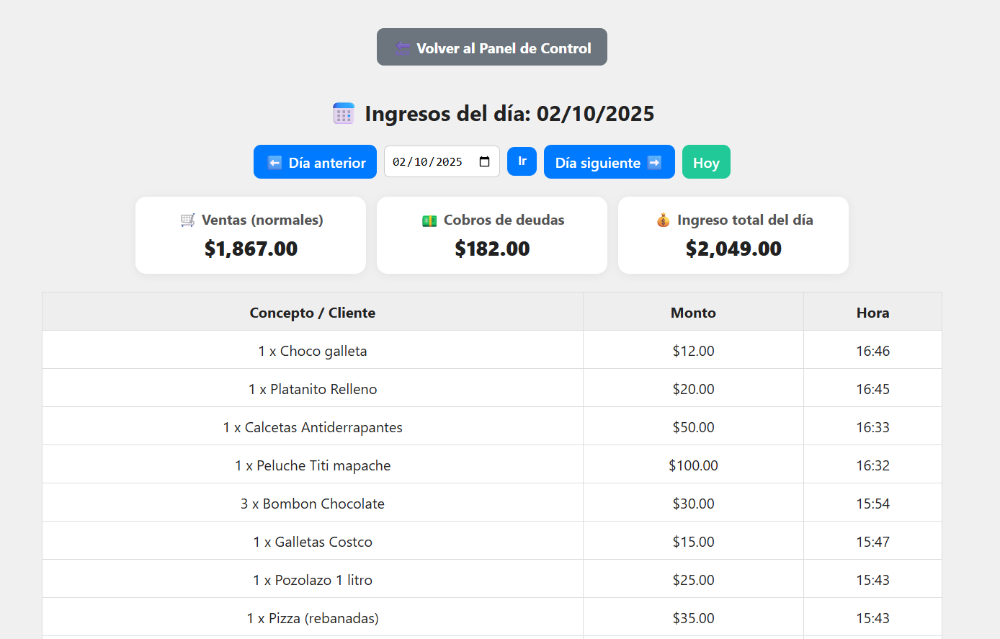
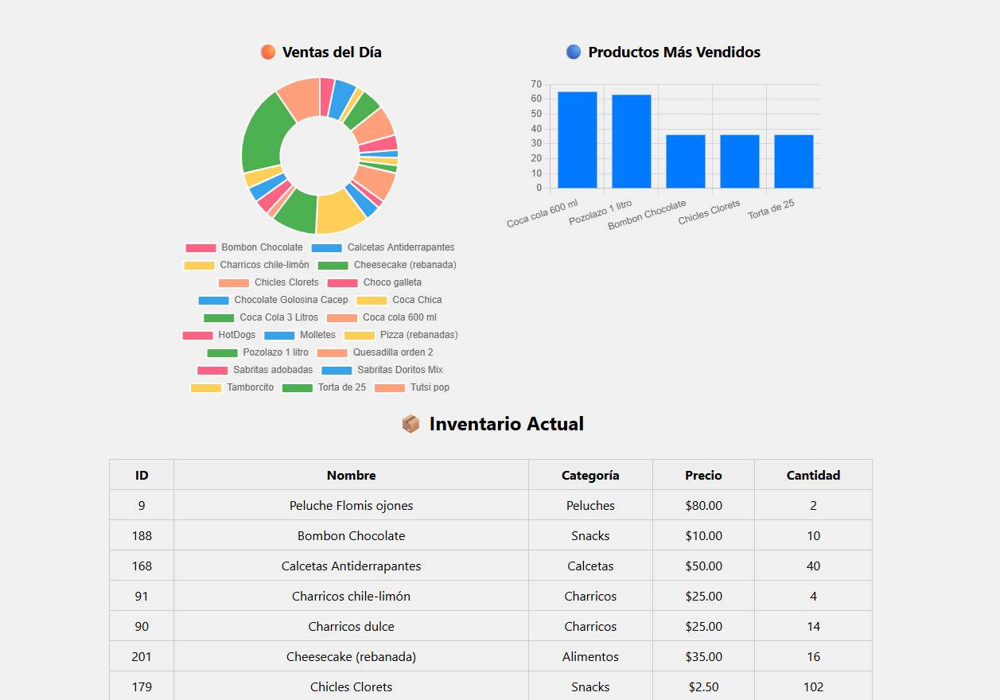
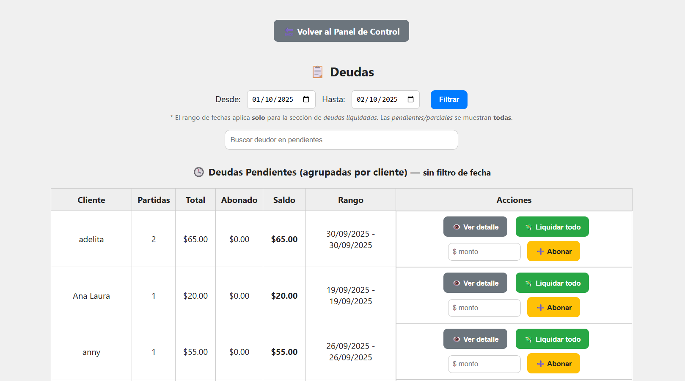

# Papagayo Store System

> Full-stack sales & inventory management system built for **Museo Interactivo Papagayo**, currently in daily production use by staff.

---

## Overview

Designed and developed from scratch to replace a manual sales process. The system centralizes point-of-sale operations, inventory tracking, and financial reporting across multiple product categories serving 50,000+ annual visitors.

---

## Features

**Point of Sale**
- Daily sales register with itemized transaction history
- Debt tracking per customer with partial payment support
- PDF/Excel export for end-of-day reports

**Inventory Management**
- Real-time stock levels across product categories
- Low-stock alerts
- Inventory entry module for restocking

**Dashboard & Analytics**
- Daily, weekly, and monthly revenue metrics
- Donut chart — sales breakdown by product
- Bar chart — top-selling products
- Multi-location tracking (Tienda, Cafetería, Pozolería, and more)

**Access Control**
- Role-based authentication: Admin, Cashier, Limited
- Session management per user type

**UI/UX**
- Dark mode support
- Fully responsive design (Bootstrap)
- Sandbox/demo mode for testing without affecting real data

---

## Tech Stack

| Layer | Technology |
|-------|-----------|
| Backend | PHP |
| Database | MySQL |
| Frontend | HTML, CSS, JavaScript, Bootstrap |
| DB Admin | phpMyAdmin |
| Reporting | Custom SQL queries + Chart.js |

---

## Screenshots

### Main Dashboard

### Daily Sales Report

### Inventory Panel

### Debt Management

---

## Status

🟢 **Active** — In production use at Museo Interactivo Papagayo since 2024.

---

## Author

**Hugo David Cortinas González**
[LinkedIn](https://www.linkedin.com/in/hugodavidcortinasgonzalez) · [GitHub](https://github.com/Hcortinas)
